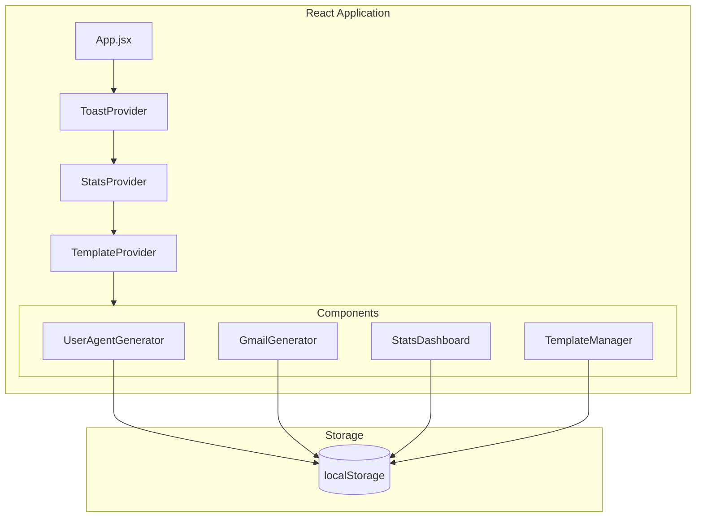

# Design Document

## Overview

This design document outlines the implementation of Custom Templates and Statistics Dashboard features for the Toolkit Generators application. The update also includes removing the Dark/Light theme toggle and fixing existing code issues.

The solution uses React Context for state management and localStorage for data persistence, maintaining consistency with the existing architecture.

## Architecture



## Components and Interfaces

### 1. StatsContext (New)

Manages generation statistics across all generators.

```typescript
interface GeneratorStats {
  totalCount: number;
  todayCount: number;
  lastUsed: string | null; // ISO timestamp
  history: { date: string; count: number }[];
}

interface StatsContextValue {
  stats: Record<string, GeneratorStats>;
  recordGeneration: (generatorType: string, count: number) => void;
  clearStats: () => void;
  getTodayCount: (generatorType: string) => number;
}
```

### 2. TemplateContext (New)

Manages custom templates for generator configurations.

```typescript
interface Template {
  id: string;
  name: string;
  generatorType: string;
  config: GeneratorConfig;
  createdAt: string;
}

interface GeneratorConfig {
  device?: string;
  browser?: string;
  version?: string;
  count?: number;
  androidPercent?: number;
  // Other generator-specific settings
}

interface TemplateContextValue {
  templates: Template[];
  saveTemplate: (name: string, generatorType: string, config: GeneratorConfig) => boolean;
  loadTemplate: (id: string) => Template | null;
  deleteTemplate: (id: string) => void;
  getTemplatesByType: (generatorType: string) => Template[];
}
```

### 3. StatsDashboard Component (New)

Displays generation statistics in a visual dashboard.

```typescript
interface StatsDashboardProps {
  onClose?: () => void;
}
```

### 4. TemplateManager Component (New)

UI for managing templates within each generator.

```typescript
interface TemplateManagerProps {
  generatorType: string;
  currentConfig: GeneratorConfig;
  onLoadTemplate: (config: GeneratorConfig) => void;
}
```

## Data Models

### Statistics Storage Schema

```json
{
  "toolkit_stats": {
    "gmail": {
      "totalCount": 150,
      "todayCount": 25,
      "lastUsed": "2025-11-25T10:30:00Z",
      "history": [
        { "date": "2025-11-25", "count": 25 },
        { "date": "2025-11-24", "count": 50 }
      ]
    },
    "useragent": { ... },
    "ipfinder": { ... },
    "numbergenerator": { ... }
  }
}
```

### Templates Storage Schema

```json
{
  "toolkit_templates": [
    {
      "id": "tpl_1732531800000",
      "name": "My Android Chrome Setup",
      "generatorType": "useragent",
      "config": {
        "device": "android",
        "browser": "chrome",
        "version": "latest",
        "count": 10,
        "androidPercent": 60
      },
      "createdAt": "2025-11-25T10:30:00Z"
    }
  ]
}
```

## Correctness Properties

*A property is a characteristic or behavior that should hold true across all valid executions of a system-essentially, a formal statement about what the system should do. Properties serve as the bridge between human-readable specifications and machine-verifiable correctness guarantees.*

### Property 1: Template Save-Load Round Trip

*For any* valid generator configuration with a non-empty name, saving the template and then loading it by ID should return an equivalent configuration object.

**Validates: Requirements 3.2, 4.1**

### Property 2: Empty Template Name Rejection

*For any* string composed entirely of whitespace characters (including empty string), attempting to save a template should return false and not add any template to storage.

**Validates: Requirements 3.3**

### Property 3: Template Deletion Removes from Storage

*For any* template that exists in storage, deleting it by ID should result in that template no longer being retrievable from storage.

**Validates: Requirements 5.1**

### Property 4: Statistics Count Increment

*For any* generation action with count N, the total count for that generator type should increase by exactly N.

**Validates: Requirements 6.1**

### Property 5: Statistics Data Structure Integrity

*For any* recorded statistic, the stored data should contain generatorType (string), totalCount (number >= 0), todayCount (number >= 0), and lastUsed (valid ISO timestamp or null).

**Validates: Requirements 6.2**

### Property 6: Statistics Clear Resets All Counts

*For any* statistics state, calling clearStats should result in all generator types having totalCount = 0, todayCount = 0, and lastUsed = null.

**Validates: Requirements 7.4**

### Property 7: Number Formatting with Separators

*For any* non-negative integer, the formatNumber function should produce a string with appropriate thousand separators that, when parsed back (removing separators), equals the original number.

**Validates: Requirements 8.2**

### Property 8: Relative Time Formatting

*For any* valid timestamp within the past year, the formatRelativeTime function should produce a non-empty human-readable string containing a time unit (seconds, minutes, hours, days, weeks, months).

**Validates: Requirements 8.3**

## Error Handling

| Error Scenario | Handling Strategy |
|----------------|-------------------|
| localStorage unavailable | Display error toast, disable save functionality |
| Invalid template name | Show validation error, prevent save |
| Template not found | Return null, show info toast |
| Corrupted storage data | Reset to defaults, show warning toast |
| JSON parse error | Catch and reset affected data |

## Testing Strategy

### Unit Testing

Unit tests will cover:
- Template validation logic (name validation)
- Statistics calculation functions
- Number formatting utility
- Relative time formatting utility
- localStorage read/write operations

### Property-Based Testing

Property-based tests will use **fast-check** library for JavaScript/React.

Each property test will:
- Run a minimum of 100 iterations
- Use smart generators that constrain to valid input spaces
- Be tagged with the format: `**Feature: custom-templates-stats, Property {number}: {property_text}**`

Properties to test:
1. Template round-trip consistency
2. Empty name rejection
3. Template deletion
4. Statistics increment
5. Statistics data structure
6. Statistics clear
7. Number formatting
8. Relative time formatting

### Integration Testing

- Test template save/load flow end-to-end
- Test statistics recording during generation
- Test dashboard display with various data states
